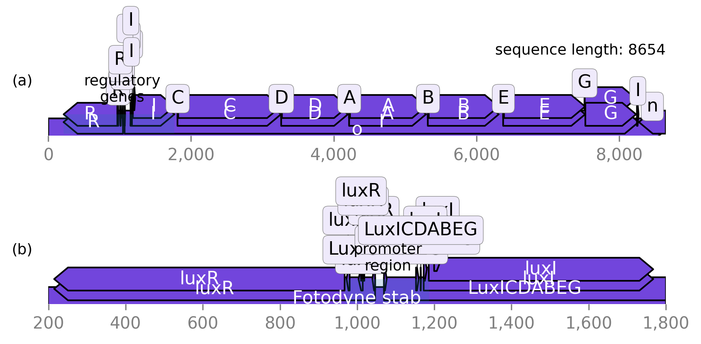
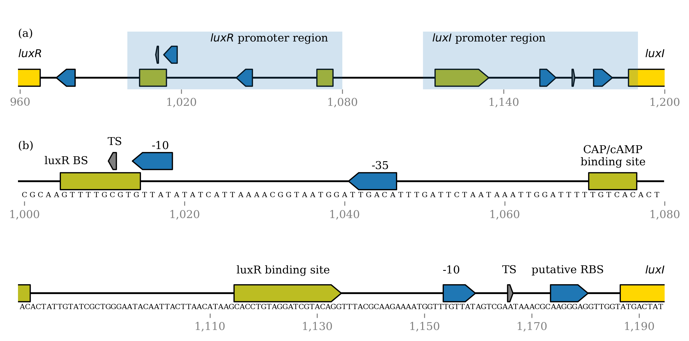
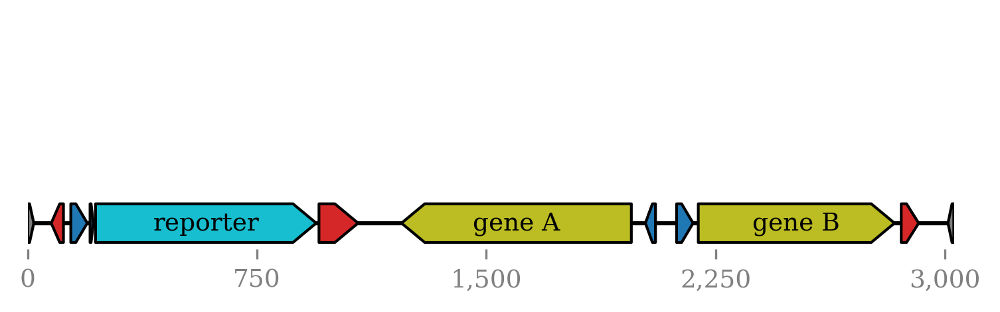
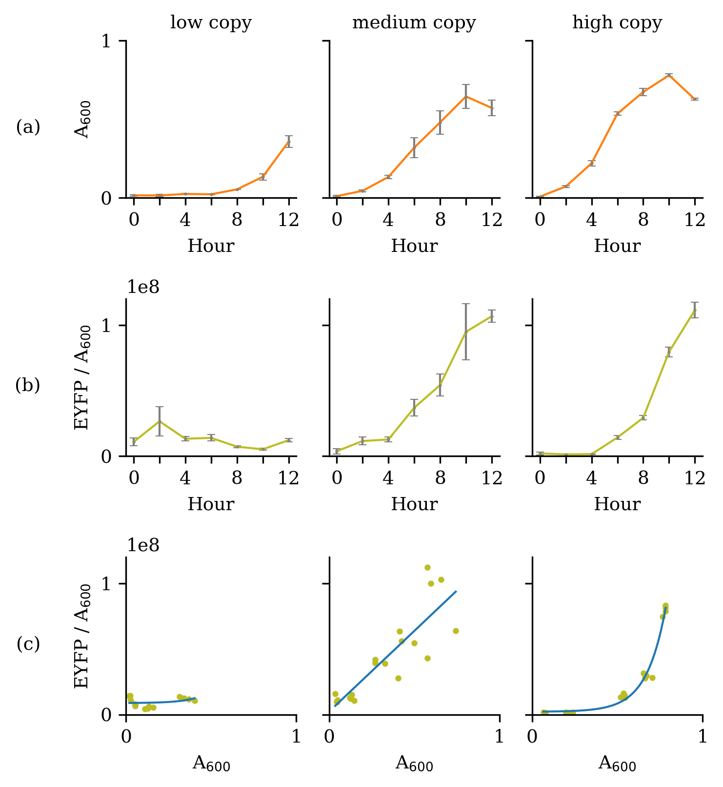
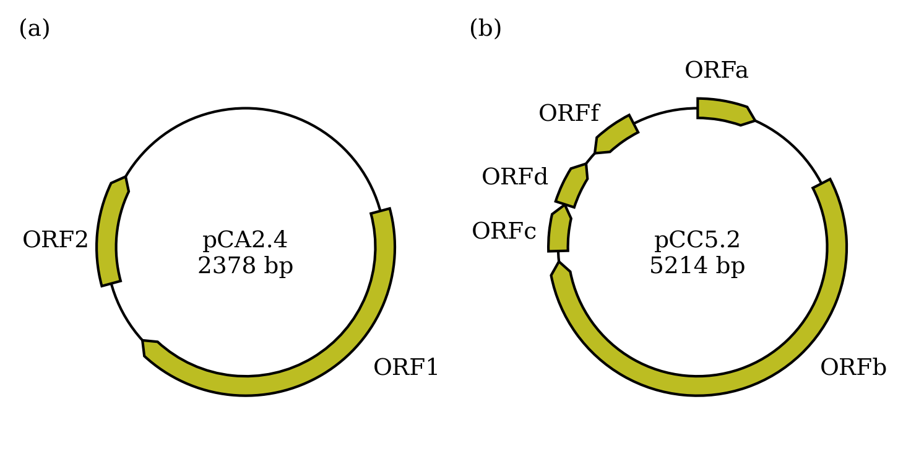
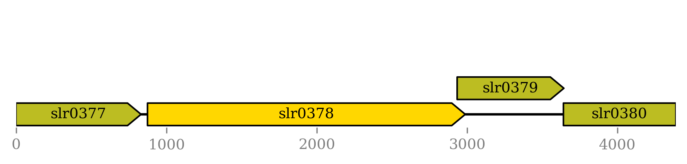
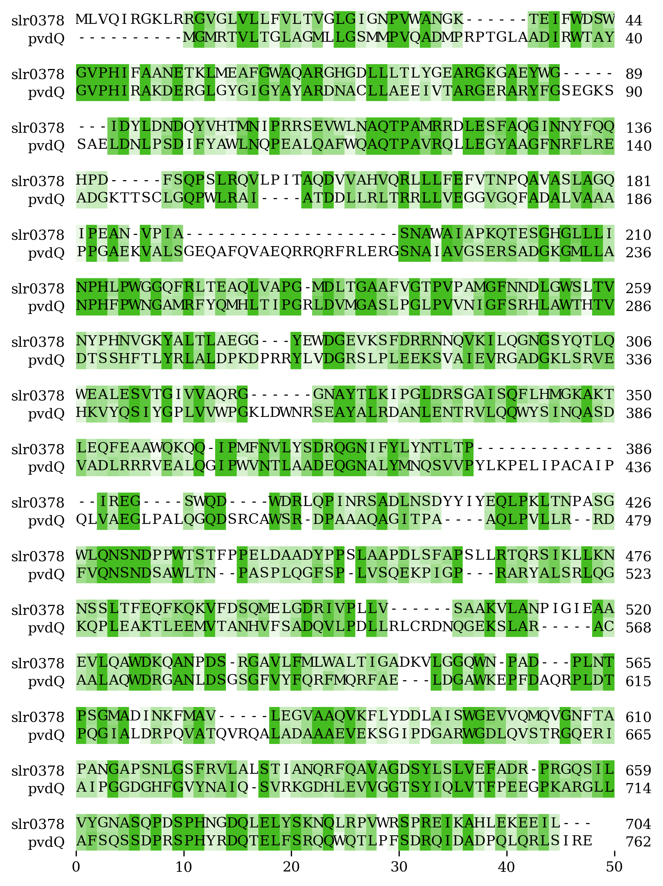

# Master Thesis Figures

This is some examples of figure generated by python library that used in my master thesis.

Here I use [dna_feature_viewer](https://github.com/Edinburgh-Genome-Foundry/DnaFeaturesViewer), to illustrate features in engineered plasmid.

The library allow robust generation of genetic map which often has a lot of variety in its content.

We can not show the actual name of genetic parts (gene, promoter, RBS) to 

Essentially, a two component system has been used in the research.

<!--

-->

<!-- Document structure
* Data
* Module
* Output
-->
